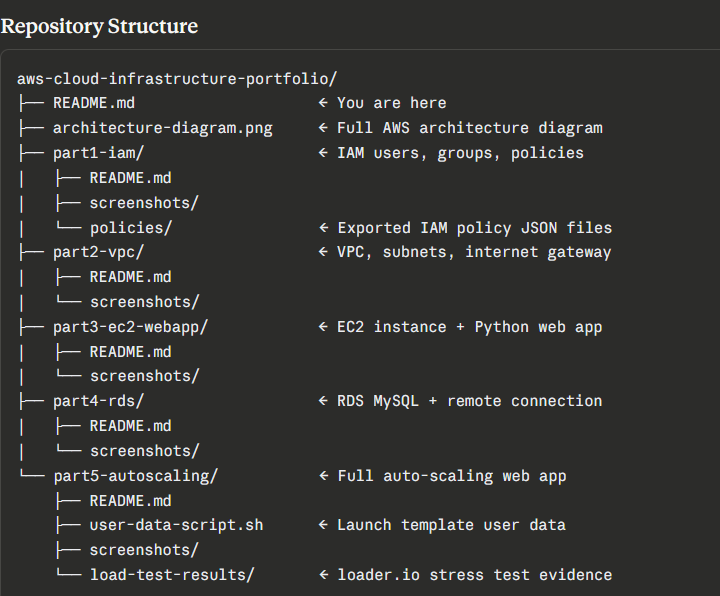
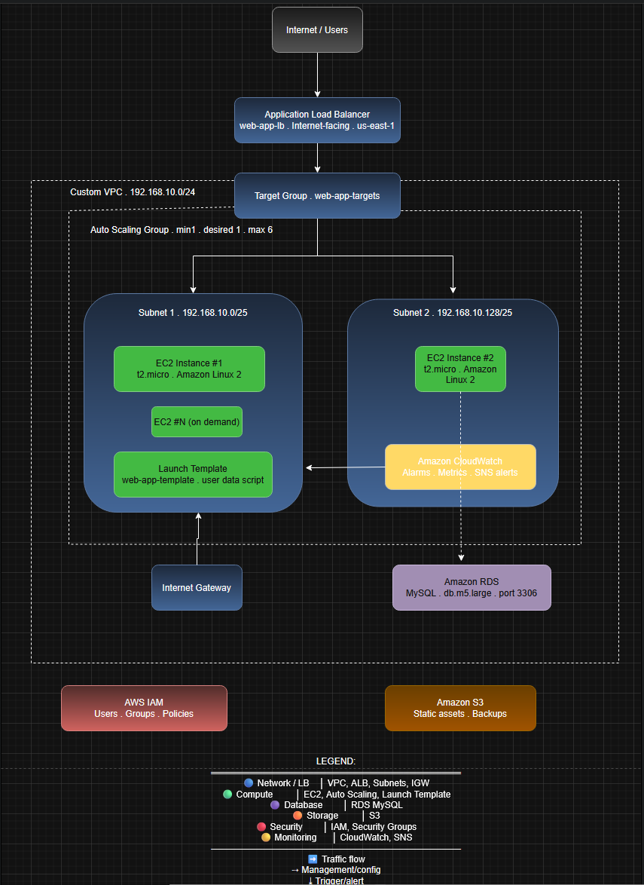
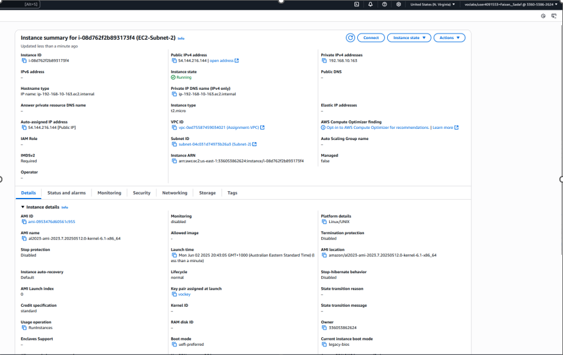
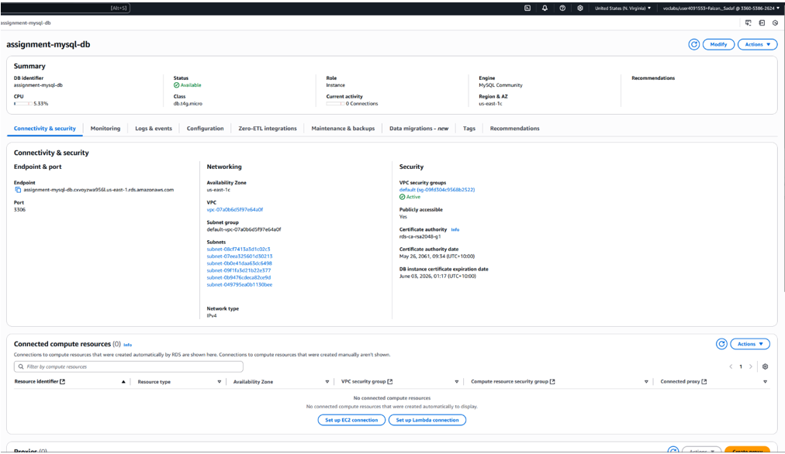
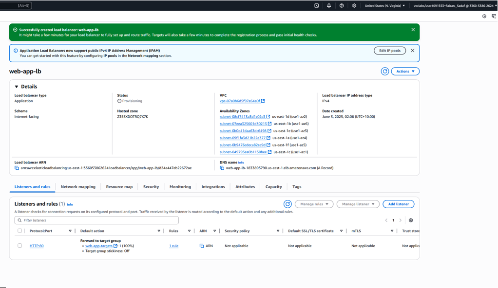

# AWS Cloud Infrastructure Portfolio

A hands-on AWS project demonstrating end-to-end cloud infrastructure deployment including IAM security, networking, compute, databases, and auto-scaling. 

## Repository Structure

##  Architecture Overview

The diagram above shows the full infrastructure: a custom VPC with public subnets, EC2 instances behind an Application Load Balancer, an RDS MySQL database and an Auto-Scaling Group managed by CloudWatch

##  What's Covered
| Part | Topic | AWS Services |
|------|-------|-------------|
| 1 | Identity & Access Management | IAM Users, Groups, Policies |
| 2 | Virtual Networking | VPC, Subnets, Internet Gateway |
| 3 | Compute & Web Hosting | EC2, Security Groups |
| 4 | Managed Database | RDS MySQL |
| 5 | Scalable Web Application | ALB, Auto Scaling, CloudWatch |

##  Tech Stack
AWS EC2 · RDS MySQL · VPC · IAM · ALB · Auto Scaling · CloudWatch · Python

##  Highlights

##About

Built as part of the Certificate IV in Cyber Security at Holmesglen Institute of TAFE (2025).
All infrastructure was provisioned in AWS (us-east-1 region) using the AWS Management Console.
